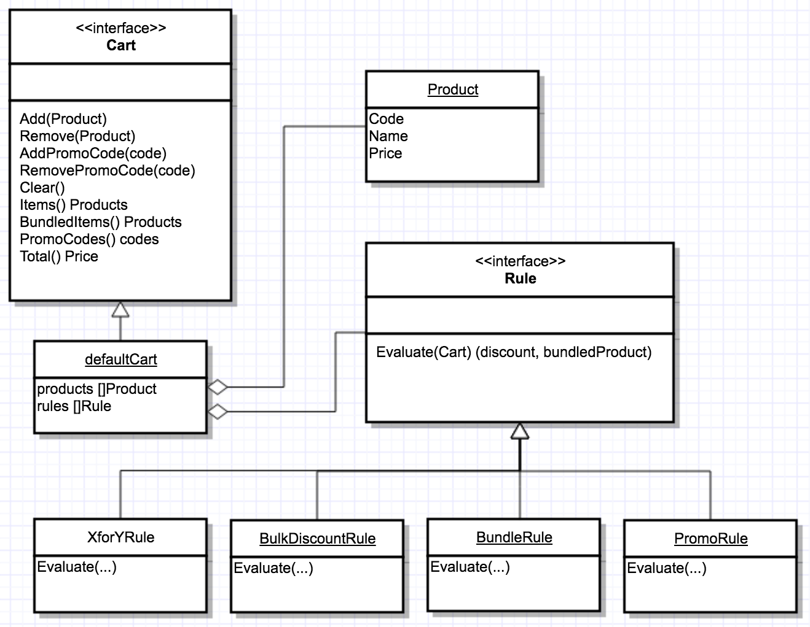

# What is this?

This it is.

# How do i build it?

Assuming you have a Go development environment setup with the $GOPATH configured:
```
go get github.com/dylanhillier/asce
cd $GOPATH/src/github.com/dylanhillier/asce/cart
go test
```

Generating test coverage:
```
go test -coverprofile=c.out
go tool cover -html=c.out
```

*Note: goimports was used in the formatting of this code.*

*"If you build it, orders will come."*
	- Dylan Hillier, 2017.

# Requirement Summary

## Important Notes:

- Assumptions in here are based on the information provide as well as the language of choice, Go.

## General
- Offers & Promotions:
	- Offers are discounts or freebies which apply by default based on a combination of selected products.
	- Promotions are additional discounts or freebies which apply given a promotion code.
- Assumption: Although the offers and promotions are to attract new customers, they will also apply to existing customers.


## Products
- Assumption: Product codes are unique.
- Assumption: Product names are not unique.
- Assumption: Prices indicated are per-month/billing cycle.
- Assumption: Products are read in from a database to form a catalogue (group of available products). Only valid/active products are loaded into the catalogue.

## Cart
- Requirement: Must support adding products.
- Requirement: Must support adding multiple of the same products.
- Requirement: Pricing Rules (Offers & Promotions) shall be provided on construction of a cart.
- Requirement: Cart should have a public member called total.
	- Assumption: This is the total after "pricing rules" have been applied.
- Requirement: Cart should have a public member called items.
	- Assumption: This is a mutable list of products the manually added to the cart and does not include "bundled" items resulting from application of rules.
- Assumption: Bundled options are treated as separate from those returned via the "Items" method. These are immutable by manual intervention. Ie. You can "Remove" one of these items via the Cart interface.
- Assumption: The "Total" value returned via the Cart interface is the sum of each product in the cart less any discounts.
- Assumption: The "Total" value indicates the first month/billing cycle charge, not the per-month cost.
- Assumption: Automatically triggered offers/promotions revert if one or more of the trigger conditions wouldn't be satisfied after a product is removed from the cart.
- Assumption: Support removal of products.
- Assumption: Support clearing of cart.

- Warning: If a promotion/offer is valid at the time the product enters the cart, but subsequently expires or the properties of the promotion/offer changed whilst the cart is pending. Are the promotions/offers honoured, or does the cart invalidate, or does the cart automatically update?
- Warning: Once a promotion is created and becomes active, it should probably never be mutated. Instead it should be marked as inactive. If a change is to be made it should have a new code or id.

## Pricing Rules

- Assumption: Pricing rules describe both offers and promotions.

Thoughts:
- Pricing rules should probably have a start/end date.
- Pricing rules should probably be markable as active/inactive.
- Pricing rules should be persistent beyond their expiry date, but marked as inactive or coped into the purchase order.
- Limitation/Question:
	- Scenario 1: 
		- Case 1: If you buy 3, then you pay for two. 
		- Case 2: If you buy 4, do you pay for 3?
		- Case 3: If you buy 5, do you pay for 4? <- Why Bother?
		- Case 4: If you buy 6, then you pay for 4.
- WARNINGS:
	- There should be some validation of rules to prevent conflicts.
	- There should be exclusion rules as part of the rule expression. Ie. Rule A will only trigger in absence of Rule B.
	- If you have an offer which discounts by x%, then you have a promo which discounts by y%. Do you apply, one or the other or both or one first, then the other. etc.
	- Do cart wide discounts apply to already discounted products?


### Offers
- Requirement: Rules for offers need to be flexible.
- Requirement: Each rules triggers when the specific products are added to the cart.


### Promotions

- Requirement: Rules for promotions need to be flexible.
- Requirement: Rules for promotions are independant of order products are added to the cart.
- Assumption: Multiple unique promotion codes can be applied to a cart.
- Assumption: Promotion codes dont need to be associated with a product.
- Assumption: Promotion codes will only apply discounts to the cart total.


# Implementation Details

## UML Diagram



## Notes

- Prices are represented as cents.
- An alternate design might be to write a rules engine. This would reduce rule definitions of any type to data at the cost of additional complexity. However, one must always note that the first rule of writing a rules engine is dont write a rules engine.
- Cart:
	- The Add(product) function currently requires the Product object. There is probably value in changing this just to a product code, then internally storing added items as just product codes, looking up the catalogue if required.
	- PriceType should be revisited, as should the representation of value for percentage discount.
	- If you add an item to the cart, and there is a rule which triggers a bundled item. But the cart is unaware of that item, then its not possible to add it via code. So, its almost a requirement to have the catalogue available to the cart. So only product codes can be used in the cart, but the full product looked up on demand.
- Rules:
	- Rules are re-evaluated as part of any interaction with the cart.
	- Any discounts which apply, are applied independant and in absence of discounts created by other rules.
	- Bundled items are not taken into account when applying discounts or rules.
- Promo Codes: (based on the provided interface cart.add(item2, promo_code))
	- Implemented promo code discounts support only cart wide discounts.
	- Improvement: Change this interface. Its nasty. Ie.
		- Promo codes don't need to apply against a product.
		- Promo codes maybe applied to a cart.
		- Go doesnt support function overloading. So this is not idiomatic go. It may be implemented using variadic functions but why bother. Just have specific/explicit functions....
		cart.add(item Product)
		cart.addWithPromoCode(item Product, code string) 
		cart.addPromoCode(code string)
